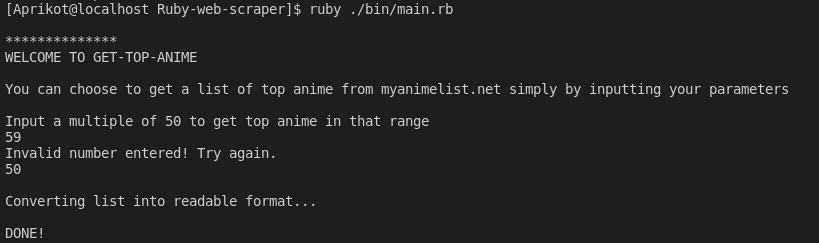
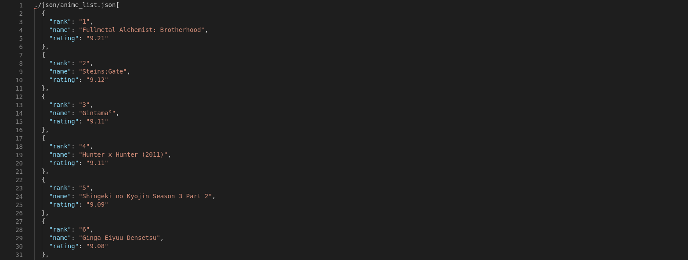

# GET-TOP-ANIME

> You never have to search for a top anime listicle again!.

> This is a web scraper built using ruby and some scraping gems to generate a list of top anime from myanimelist.net

## Built With

- Ruby
- Nokogiri
- HTTparty
- JSON

## Getting Started

To get a local copy up and running follow these simple example steps.

### Prerequisites
    Ruby installed locally
### Setup
     Clone repository into your local machine via :

         $ git clone https://github.com/apricot12/get-top-anime

### Usage
    1) Navigate into the project folder and run main.rb by typing in : 

         $ ruby ./bin/main.rb

    2) You will be prompted to input a multiple of 50, doing so will generate a top anime list from 1 to input number.

    3) Once you get an output "DONE!" in your terminal, a new anime_list.json file will be found in ./json/ folder.

    4) Inside the anime_list.json you'll find the anime list ordered according to rank and rating from the site as seen in the screenshot -
   

    5) Enjoy watching anime.. :)

### Run tests
    You can run tests simply by running the given command in terminal :

         $ rspec ./spec/tests_spec.rb

## Authors

👤 **Author1**

- GitHub: [@apricot12](https://github.com/apricot12)
- Twitter: [@apricotfoxtrot](https://twitter.com/apricotfoxtrot)
- LinkedIn: [LinkedIn](https://linkedin.com/in/aprikot-web)

## 🤝 Contributing

Contributions, issues, and feature requests are welcome!

Feel free to check the [issues page](issues/).

## Show your support

Give a ⭐️ if you like this project!

## 📝 License

This project is [MIT](lic.url) licensed.
